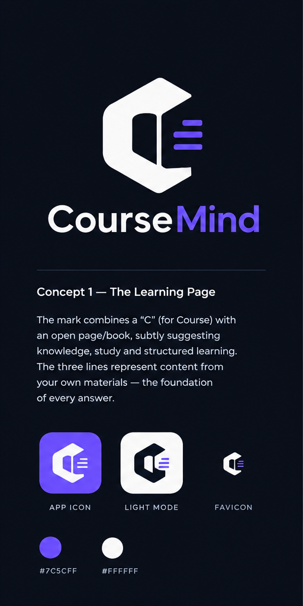

# CourseMind



> A syllabus-bounded, self-testing, citeable AI course tutor.

CourseMind answers student questions **using only a lecturer's own materials**,
cites the exact source slide/page, **refuses** anything off-syllabus, and
continuously grades its own accuracy against a lecturer-curated question set —
failing CI when accuracy regresses. Each course is also exposed as an **MCP server**
so Claude, ChatGPT, or VS Code can query it.

**Stack:** TypeScript (web · API · MCP) + Python (ingestion · evaluation) +
PostgreSQL/pgvector. Built for low-end Android and metered data (Nigerian context).

## Status

🟢 **Milestone 2 — Ingestion: complete.** Upload → parse → chunk → embed → store,
with a NestJS API, the Python pipeline, CI, and a one-command Docker stack.

| Milestone | Status |
| --- | --- |
| 1. Docs (PRD, SRS, SDD, ADR) | ✅ done |
| 2. Ingestion | ✅ done (scaffold · DB · Python pipeline · API · CI · compose) |
| 3. Retrieval + chat UI | 🔜 [planned](./docs/milestones/M3-retrieval-chat.md) |
| 4. Accuracy tests + CI gate | ⬜ |
| 5. MCP server | ⬜ |
| 6. Student pilot + observability | ⬜ |

## Run locally (one command)

```bash
cp .env.example .env        # then set GOOGLE_API_KEY (embeddings, ADR-0002 §2)
docker compose -f infra/docker-compose.yml up
```

Brings up Postgres+pgvector, applies migrations (one-shot), and starts the
Python ingestion service (`:8000`) and the NestJS API (`:3000`). Details and the
CI workflow: [DEVELOPMENT.md](./DEVELOPMENT.md).

## Documentation

- 📄 [Product Requirements (PRD)](./docs/PRD.md) — problem, scope, personas, metrics
- 📄 [Software Requirements (SRS)](./docs/SRS.md) — FR/NFR/privacy/security requirements
- 📄 [Software Design (SDD)](./docs/SDD.md) — architecture, data model, pipelines
- 📄 [ADR-0001](./docs/adr/0001-vector-store-pgvector-vs-dedicated.md) — pgvector vs. dedicated vector DB
- 📄 [ADR-0002](./docs/adr/0002-model-and-retrieval-configuration.md) — LLM/embeddings/reranker/index config
- 📄 [ADR-0003](./docs/adr/0003-migration-tooling-node-pg-migrate.md) — migration tooling (node-pg-migrate)
- 📄 [ADR-0004](./docs/adr/0004-query-embedding-location.md) — query embedding via the Python /embed endpoint
- 🎨 [Brand & Theme](./brand/BRAND.md) — logo concept, colour palette, design tokens
- 📐 [Project Rules](./CLAUDE.md) — engineering conventions & guardrails
- 🗂️ [Milestone 2 plan — Ingestion](./docs/milestones/M2-ingestion.md) — task checklist

## Planned monorepo layout

``` txt
apps/web            # Next.js (TS) — student chat + lecturer dashboard
apps/api            # Fastify/NestJS (TS) — auth, retrieval, streaming, cost
packages/mcp        # MCP server (TS)
packages/retrieval  # shared retrieval client (TS)
services/ingest-eval# FastAPI worker + eval runner (Python)
docs/               # PRD, SRS, SDD, ADRs
infra/              # docker-compose, migrations
```

## Why this exists

Generic chatbots answer beyond the syllabus and cite nothing. CourseMind is the
opposite: grounded, cited, and measured. See the [PRD](./docs/PRD.md) for the full
rationale.
