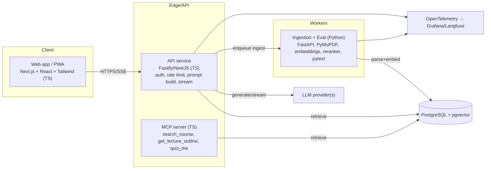
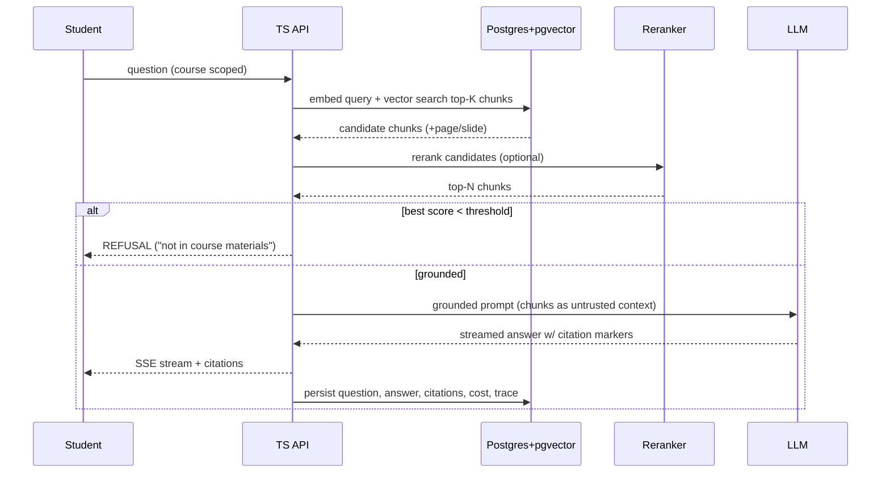
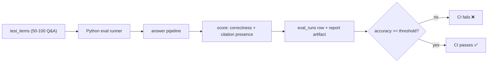

# CourseMind — Software Design Document (SDD)

**Status:** Draft v1.0
**Author:** Reiker Nodd
**Last updated:** 2026-09-25
**Related docs:** [PRD](./PRD.md) · [SRS](./SRS.md) · [ADR-0001](./adr/0001-vector-store-pgvector-vs-dedicated.md)

---

## 1. Purpose
This document describes *how* CourseMind is built to satisfy the [SRS](./SRS.md).
It covers architecture, the language split, data model, retrieval/answer pipeline,
the evaluation/CI gate, the MCP server, and privacy mechanics.

## 2. Design principles
- **Grounded or silent.** No answer without a supporting chunk; refuse otherwise. *(FR-10, FR-12)*
- **Right language for the job.** TypeScript owns the product surface (web/API/MCP); Python owns document parsing, embeddings, and evaluation, where the libraries are strongest.
- **One database.** Relational data and vectors live together in Postgres+pgvector to keep a solo-dev system simple and consistent. *(ADR-0001)*
- **Privacy by construction.** Pseudonymous student ids, bounded retention, erasure support. *(PR-1..PR-9)*
- **Measured, not vibes.** Every answer is traced; accuracy is a CI gate, not a feeling.

## 3. Architecture overview



Text description: the browser talks only to the TypeScript API (and the MCP server
talks to machine clients). The API performs retrieval against Postgres, builds a
grounded prompt, and streams the LLM response. Document ingestion and accuracy
evaluation run in the Python service. Everything emits OpenTelemetry traces.

## 4. Component design

### 4.1 Web app (TypeScript — Next.js/React/Tailwind)
- Student chat with streamed answers and inline citations *(FR-8, FR-11, FR-13)*.
- Low-data mode toggle: disables non-essential assets, compact payloads *(FR-14, NFR-2)*.
- Lecturer dashboard: ingestion status, accuracy score, cost per question *(FR-5, FR-21, FR-29)*.
- Source viewer: open cited page/slide passage *(FR-15)*.
- Consent capture on first use *(PR-2)*.

### 4.2 API service (TypeScript — Fastify or NestJS + Vercel AI SDK)
Responsibilities: auth & RBAC, per-student rate limiting, retrieval orchestration,
grounded prompt construction, streaming, model switching/fallback, cost/telemetry.
- **Endpoints (illustrative):**
  - `POST /courses/:id/ask` → SSE stream of answer + citations *(FR-8..FR-14)*
  - `POST /courses` / `POST /courses/:id/documents` (upload → enqueue ingest) *(FR-1)*
  - `GET  /courses/:id/status` *(FR-5)*
  - `GET  /courses/:id/chunks/:chunkId` → `{ chunk_id, document_id, filename, page, text }` — cited passage for the source viewer; course-scoped, unknown/other-course chunk → 404 *(FR-15, SR-2)*
  - `GET  /courses/:id/accuracy` *(FR-21)*
  - `POST /answers/:id/rating` *(FR-16)*
- Treats retrieved document text as untrusted; injection-resistant prompt layout *(SR-3)*.

### 4.3 Ingestion + Evaluation (Python — FastAPI worker)
- **Parse:** PyMuPDF for PDFs, python-pptx for slides; preserve page/slide numbers *(FR-2)*.
- **Chunk:** configurable strategy (fixed-size w/ overlap default; heading-aware optional) *(FR-3, FR-7)*.
- **Embed:** batch-embed chunks; store vectors *(FR-4)*.
- **Idempotency:** skip/replace by document content hash *(FR-6)*.
- **Evaluate:** run test set through the answer pipeline; score correctness + citation presence; emit report *(FR-19..FR-22)*.
- Exposed as an internal HTTP API + a CLI runnable in CI.

### 4.4 MCP server (TypeScript — MCP SDK)
- Tools: `search_course` (M), `get_lecture_outline` (S), `quiz_me` (C) *(FR-25..FR-27)*.
- Authenticated; course-scoped *(FR-28, SR-2)*.
- Shares the retrieval module with the API to avoid divergence.

### 4.5 Data store (PostgreSQL + pgvector)
Single source of truth for relational + vector data *(ADR-0001)*.

## 5. Data model (initial)

```
users(id, role, institution_id, created_at)                     -- pseudonymous student id (PR-1)
courses(id, owner_id, title, created_at)
documents(id, course_id, filename, content_hash, status, pages) -- status: queued|processing|ready|failed (FR-5,FR-6)
chunks(id, document_id, course_id, page, char_start, char_end, text)
chunk_embeddings(chunk_id, embedding vector(768))               -- pgvector; HNSW index (ADR-0001, ADR-0002)
embedding_meta(id, embedding_model, dim, created_at)            -- guards against mixed-model reads (ADR-0002)
questions(id, course_id, student_id, text, created_at, consent_version)  -- retention-bounded (PR-2,PR-4)
answers(id, question_id, text, refused bool, latency_ms, input_tokens, output_tokens, cost_usd, model)
answer_citations(answer_id, chunk_id, page, document_id)         -- every claim traceable (FR-11)
ratings(answer_id, student_id, value, created_at)                -- thumbs up/down (FR-16)
test_items(id, course_id, question, expected, must_cite bool)    -- lecturer test set (FR-19)
eval_runs(id, course_id, git_sha, accuracy, citation_rate, created_at)  -- history (FR-21)
consents(student_id, version, granted_at)                        -- (PR-2)
audit_log(id, actor_id, action, target, created_at)              -- data-access audit (PR-6, SR-6)
```

### 5.1 Retention & erasure (privacy mechanics)
- A scheduled job deletes/anonymises `questions` older than the retention window *(PR-4)*.
- Erasure request hard-deletes a student's `questions`, `answers` (their own), `ratings` *(PR-5)*.
- Aggregate `eval_runs` and anonymised metrics survive erasure (no PII).

## 6. Retrieval & answer pipeline



**Grounding contract:** the prompt instructs the model to answer only from provided
context, to cite each claim by `[doc:page]`, and to output the refusal token when
context is insufficient. The API validates that cited chunk ids exist; answers with
invented citations are treated as failures *(FR-11, SR-3)*.

## 7. Evaluation & CI gate



- Runs **per-PR and nightly** *(FR-23)*.
- Scoring: exact/semantic match for correctness + presence of a valid citation; refusal cases scored on correct-refusal.
- Threshold configurable per course; regression fails the build *(FR-22)*.

## 8. Observability *(NFR-6, NFR-7)*
- OpenTelemetry spans per request: retrieval time, rerank time, LLM time, tokens, cost.
- Exported to Grafana or Langfuse; dashboards for accuracy, latency, and cost/1k questions.

## 9. Security design *(SR-1..SR-7)*
- Auth + RBAC at the API; course-scoping enforced in the retrieval layer (shared by API and MCP).
- Secrets via environment/secret manager, never shipped to client.
- Document text sandboxed as untrusted context; injection tests in CI (stretch).
- Rate limiting per student on answer endpoints.

## 10. Deployment (pilot)
- Containers: `web`, `api`, `mcp`, `ingest-eval`; managed Postgres with pgvector.
- One-command local run via docker-compose; documented in README *(NFR-12)*.
- CI: lint + unit tests + accuracy gate on PR; nightly full eval.

## 11. Monorepo layout (target)
```
coursemind/
  apps/
    web/            # Next.js (TS)
    api/            # Fastify/NestJS (TS)
  packages/
    mcp/            # MCP server (TS)
    retrieval/      # shared retrieval client (TS)
  services/
    ingest-eval/    # FastAPI worker + eval runner (Python)
  docs/             # PRD, SRS, SDD, ADRs  ← current deliverable
  infra/            # docker-compose, migrations
```

## 12. Technical decisions & open questions

**Resolved** (see [ADR-0002](./adr/0002-model-and-retrieval-configuration.md)):

- Embedding model & dimension → Google `text-embedding-004` (free tier), `vector(768)`.
- Vector index → HNSW.
- Reranker → none for MVP; local cross-encoder later if hit-rate is weak.
- LLM provider → `.env`-configurable, Anthropic default.

**Still open:**

- HNSW `m` / `ef_construction` / `ef_search` tuning (needs real data volume).
- LLM fallback provider/ordering *(NFR-4)* — decide with cost/latency data.
